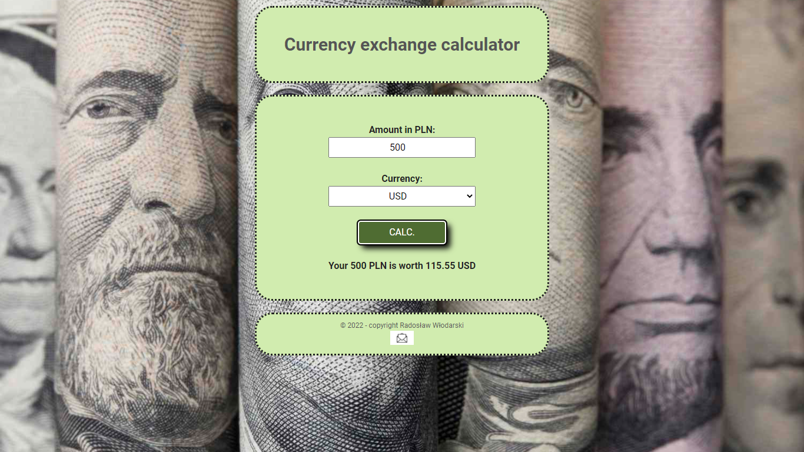

# Currency Exchange Calculator

## DEMO:
https://radekw86.github.io/currency-converter-basic/

This basic calculator allows you to convert 1-1000 PLN into respective USD, EUR, GBP, CHF values.

html, CSS & BEM, JS ES6+

